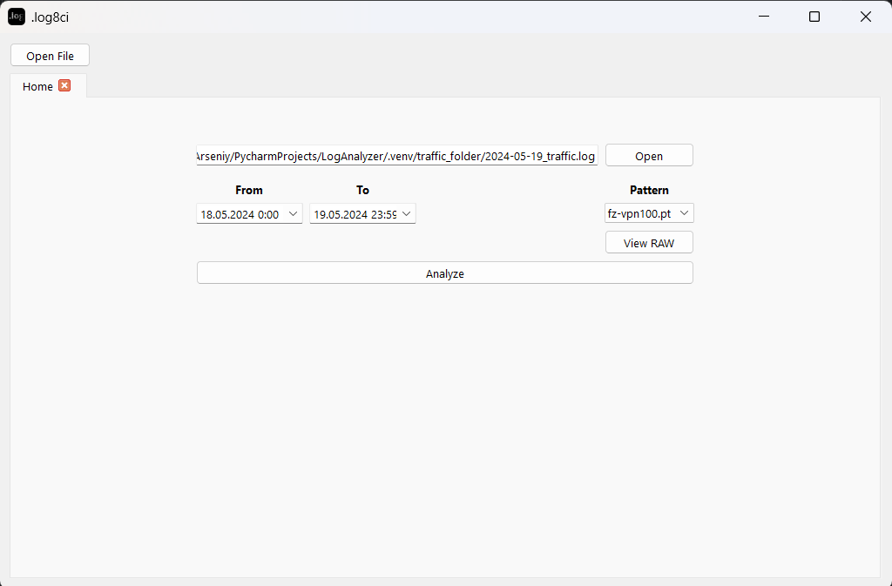

# LogAnalyzer_v2 (preview)

#### **Назначение**  
LogAnalyzer_v2 — это инструмент для анализа логов сетевого оборудования. Он предназначен для обработки, фильтрации и визуализации лог-файлов, упрощая работу с большими объемами данных. Программа полезна для системных администраторов, инженеров по информационной безопасности и IT-специалистов, занимающихся мониторингом и анализом сетевых событий.  

#### **Функциональные возможности**  
- **Поддержка анализа файлов и папок с логами** — возможность загружать и обрабатывать отдельные файлы или целые каталоги.  
- **Фильтрация по времени** — удобный поиск и фильтрация логов по заданному временному диапазону.  
- **Два режима отображения**:
  - **RAW-формат** — отображение логов в исходном виде.  
  - **Табличный режим** — структурированное представление данных для удобства анализа.  
- **Генерация статистики** — подсчет и группировка данных по выбранным столбцам (например, количество уникальных IP-адресов, MAC-адресов и т. д.).  
- **Корреляция данных** — возможность связывать значения одного столбца с данными из других столбцов, выявляя зависимости.  
- **Авторазрешение IP-адресов в доменные имена** — автоматическое преобразование IP-адресов в читаемые доменные имена.  
- **Группировка данных по количеству** — анализ встречаемости значений для выявления аномалий и тенденций.  
- **Поддержка универсального формата логов** — возможность работы с разными форматами логов через настраиваемые шаблоны парсинга.  

#### **Технические характеристики**  
- **Язык программирования**: Python  
- **Стек технологий**: pandas, PyQt5, NumPy, Matplotlib  
- **Платформа**: Windows 10+

#### Программа работает на вкладочной структуре, ниже приведены несколько информативных 

**Вкладка открытия файлов**

**Диаграмма саммари**

**Диаграмма статистики**

